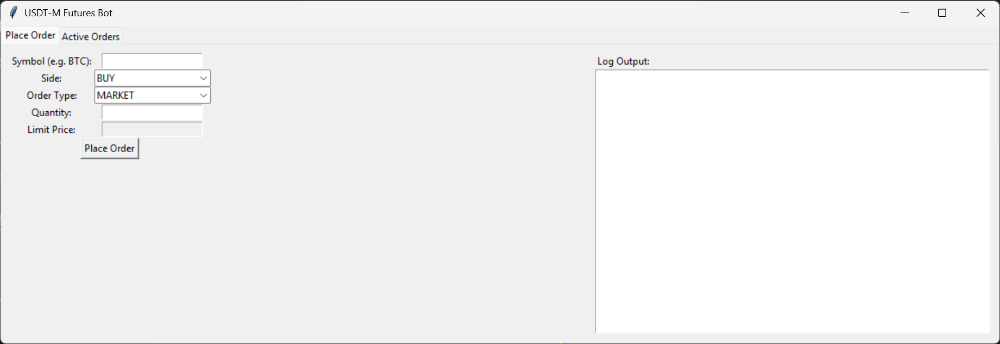
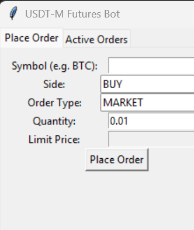
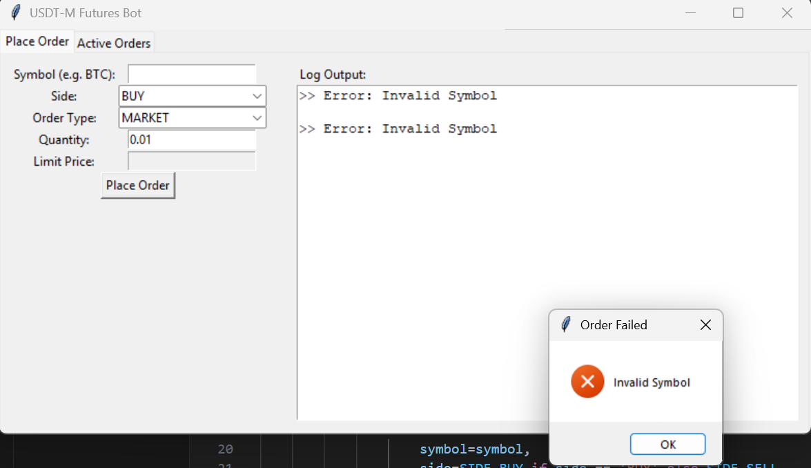
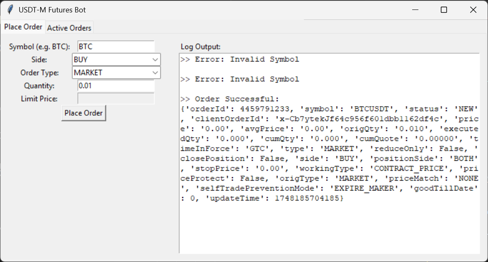
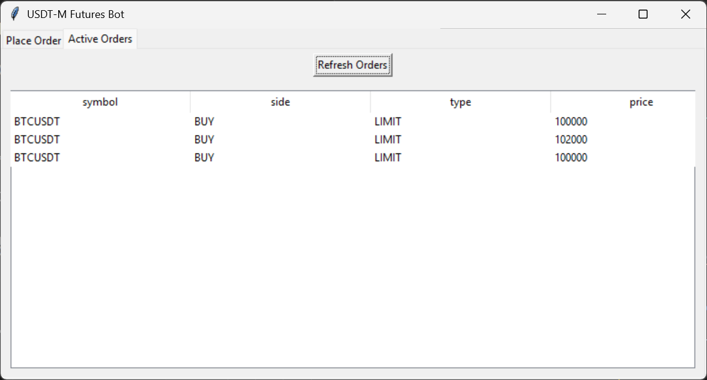
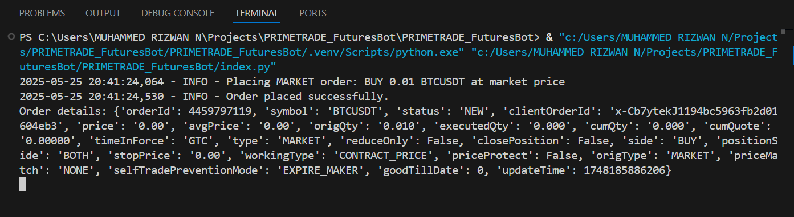

# Binance Futures USDT-M Trading Interface (with GUI)

This Python application provides a simple graphical interface for handling **Futures trading on Binance (USDT-M pairs only)**. It allows users to easily place **Market** and **Limit** orders via a GUI built using `tkinter`, with real-time feedback, integrated logging, and robust error handling.

---

## 🔧 Features

### ✅ Order Placement Interface
- Place **Market** and **Limit** orders on Binance USDT-M Futures.
- Supports both **Buy** and **Sell** order types.
- Clean and dynamic form layout that adjusts fields based on order type.
- Accepts and validates user inputs from the GUI.
- All order placements are handled through the official **Binance REST API**.

### ✅ Logger Panel
- A dedicated **Logger Textbox** is displayed on the **right side** of the **"Place Order"** tab.
- Dynamically sized to occupy **half of the page width**.
- Displays detailed logs of order submissions, responses, and error messages in real time.

---

## 🖥️ GUI Overview

The user interface is organized using a tabbed layout (`tkinter.Notebook`):

- **Place Order Tab**: The primary interface for manually entering and submitting market/limit orders.
- **Logger Section**: Attached directly to the right side of the order form to provide immediate feedback and status updates.
- **Active Order Tab**: This section can be used to view all the active orders placed by the user. The data can be updated using the **Refresh Orders** button.

---

## 🛡️ Error Handling

All functions in the application are wrapped in proper `try-except` blocks. Errors are:
- Logged into the Logger Panel for developer insight.
- Displayed as pop-up alerts using `tkinter.messagebox` for user clarity.

This ensures both transparency and stability when interacting with the Binance Futures Testnet API.

---

## 🧪 Testnet Support

The interface is built to operate on the **Binance USDT-M Futures Testnet**, making it safe for simulation and testing of live-like trades without real funds.

---

## 🧰 Requirements

- Python 3.7 or above
- `python-binance` (Python Binance API client)
- `tkinter` (comes pre-installed with most Python distributions)
- Internet connection for API access

---

## 🚀 How to Run

- Install Dependencies
  Ensure you have Python 3.7+ installed. Then install the required package:
  `pip install python-binance`

- Set Up API Credentials
  Acquire your Binance Futures Testnet API credentials and save them in the following files:

    keys/testnet_api_key.txt – your API key
    keys/testnet_api_secret.txt – your API secret

- Run the Application
  Execute the main script:
    `python index.py`

---

## 🖼️ Output Images

-Screenshots of the GUI interface:
     

---

## 📌 Notes

Only USDT-Margined Futures pairs are supported (e.g., BTCUSDT, ETHUSDT).

Meant for educational and testnet purposes only.

Do not use with live funds unless fully tested and understood.

